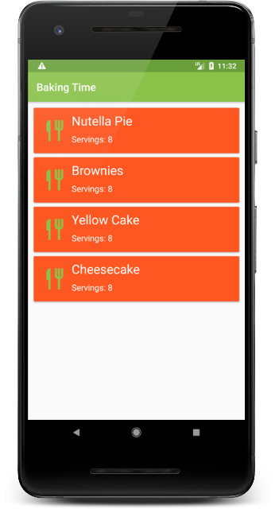
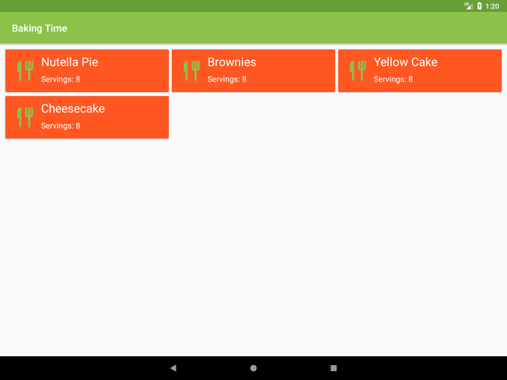

### :small_blue_diamond: Project Year: 2018 :small_blue_diamond:
#### (Udacity Android Developer Nanodegree Project 3)
# Baking Time: Android App for Recipes with Videos
### An app to view video recipes that incorporated media loading, verifying user interfaces with UI tests, integrated third party libraries and provided a complete UX with home screen widget.
---

* Technologies: Java, XML, JUnit
* Platform Features: Widgets, Exoplayer, Espresso Tests, AsyncTaskLoader, RecyclerView, CardView, Shared Preferences
* Libraries: Android Support, Picasso, Gson
* Tools and OS : Android Studio, Ubuntu
* Platform: Android 4.1+
* Modules: Recipe, Step, Ingredient
* Lines of Code:  2301
* Duration: 1 Week (JAN 2018)

### Screenshots

